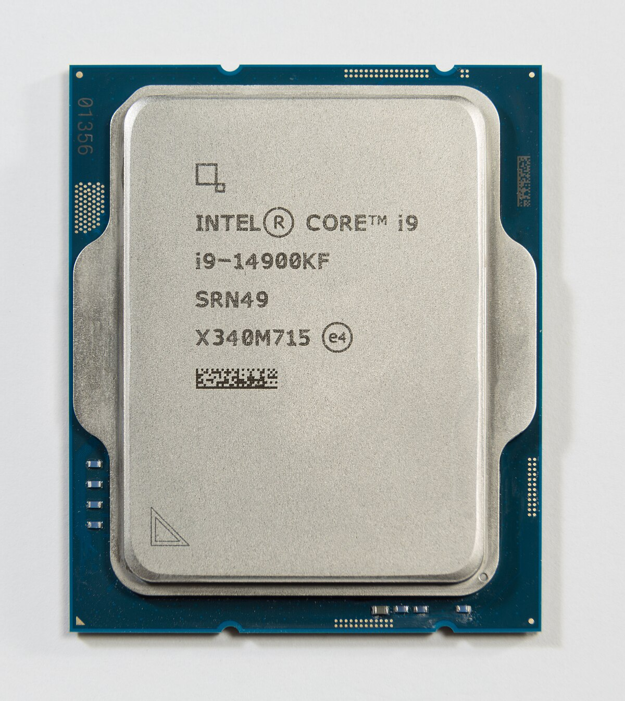
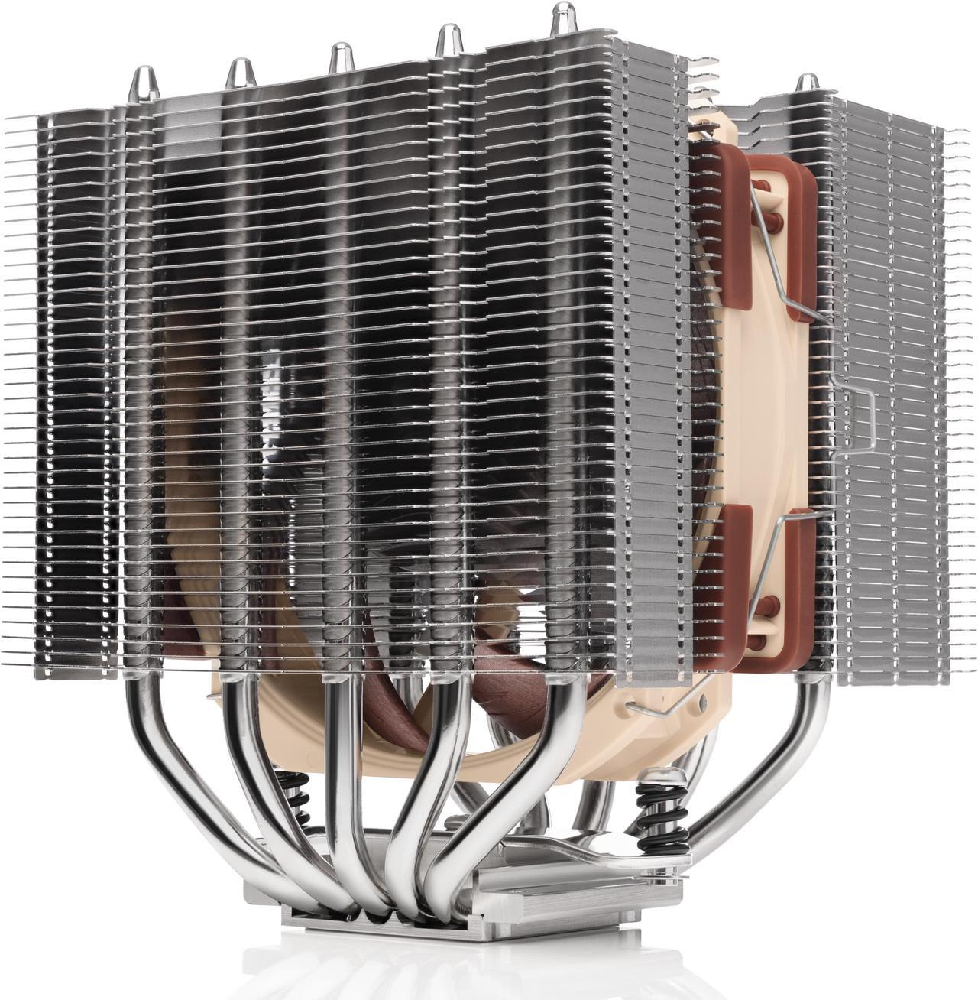
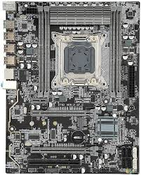
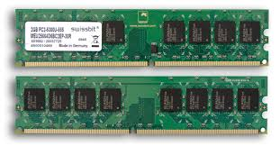
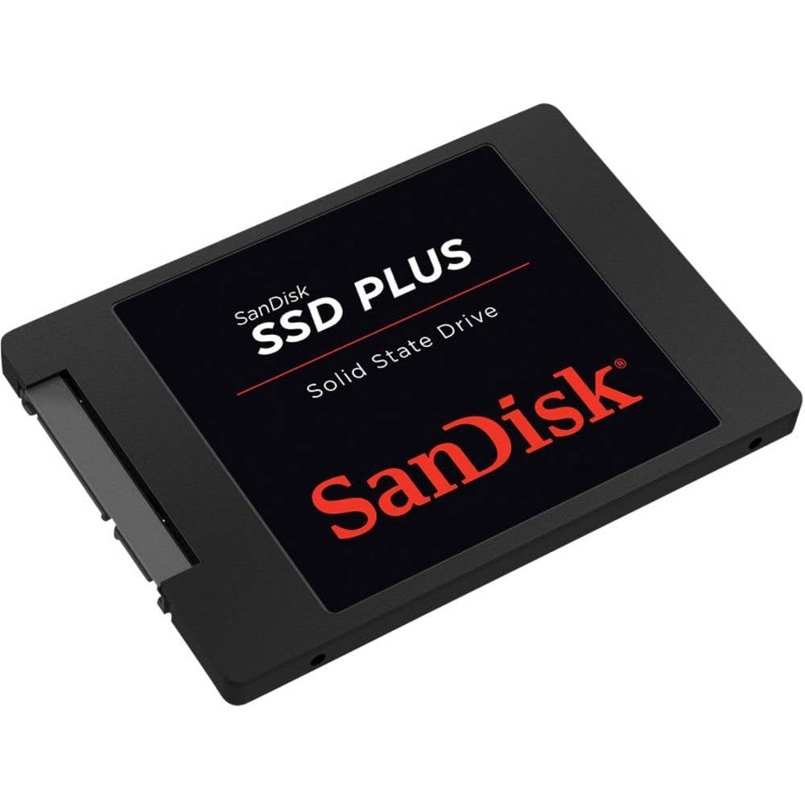
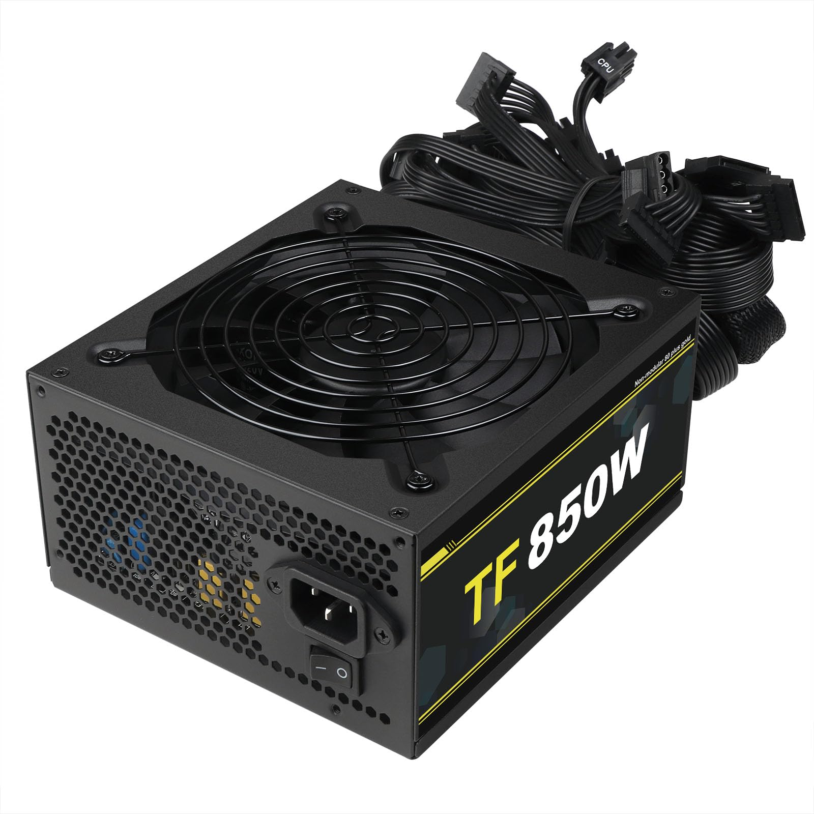
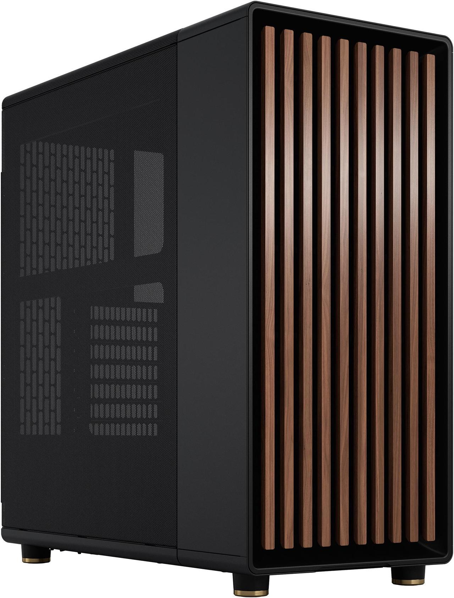

# Before you read
This document serves as an intrudoction to building computers. The document contains the basic components required to physically build a computer. This document does not detail specific requirements for parts and interoperability between some parts. This document assumes you have no knowledge regarding the physical compnents of computers.

# Introduction
The information in this section explains the names of certain computer parts, what they do, and what they look like, including examples. To keep this document at a beginner level, this document will only list required parts for a computer to function. Optional parts will be listed in another document.

# Required Components
* Central Processing Unit (CPU) - The CPU is often called the brain of the computer. CPU's manage the information within the computer and directs the information to where it should go. CPU's are small squares of metal that have smaller raised, polished metal on top of a circuit board type of structure that is often colored. Some CPUs can often include GPUs(see below) as part of their configuration and function. CPUs that contain GPUs are called APUs and can process graphics similar to a dedicated GPU but maintain the size of the CPU. CPUs/APUs are often said to have an iGPU which stands for Integrated Graphics Processing Unit. In order for information from a computer to be display, some sort of GPU, integrated or dedicated, is required.

  

* CPU Cooler - CPU Coolers are components, in the form of metal blocks with copper piping, that attach to motherboards on top of the CPU. CPUs get exceptionally hot and can run slower or fail to function at high temperatures. CPU Coolers are necessary for a CPU to run.

  

* Motherboard - Motherboards, sometimes referred to as mainboards, are circuit boards that attach to and store the other main parts of a computer. After other parts of a computer are attached to a motherboard, those parts and the motherboard itself can transfer information from one part to another. Motherboards are much larger than CPUs and are often square with physical slots to connect other computers, like the CPU and RAM. Motherboards also connect to the case, or chassis, and allow information to be transferred from devices connect to the case.

  

* Random Access Memory (RAM) - RAM reads, stores, and changes data. RAM is inserted into specific slots on motherboards and looks like a small, flat circuit board.

  

* Storage - Storage comes in many forms and has many names. Data within a storage device can be accessed by end users. For example, you can see pictures or documents stored within storage and can interact with it. The two most common forms of storage drives are Hard Disk Drives (HDDs) and Solid State Drives (SSDs). Within those two types, there are many forms and and protocols that have different sizes, but that information is better explained in additional document. HDDs are larger devices that contain spinning disks in small metal boxes. You often won't see a spinning disk within an HDD, but can be heard my clicks when an arm is writing information to the disk if powered on. SSDs are solid components that contain even smaller components that look similar to smaller CPUs.
 

  

* Power Supply - Power supplies input power from an outlet and provide power to the computer. Power supplies are electrical devices, that look like boxes with fans on top, with wires coming out the back.

  

* Case - Computer cases house all other internal components. Cases come in wildly different forms and shapes. Technically, computers can be built without the use of a case, for beginners they are required.

  

# Non-required Components
Again, to keep this document simple, this section will only list one non-required component, even though there are countless additional components that can be added to commputer builds. 

* Video Card or Graphics Processing Unit (GPU) - GPUs are sometimes referred to as graphics or video cards. Graphics cards allow computers to show information on an external display, like a monitor. Graphics cards allow computers to display more technically complex or visually difficult to render information. Graphics cards are often the second largest single component in a computer after the motherboard. Graphics cards look like smaller motherboards with plastic cases that contain fans to cool the internal components on the circuit board.

  

